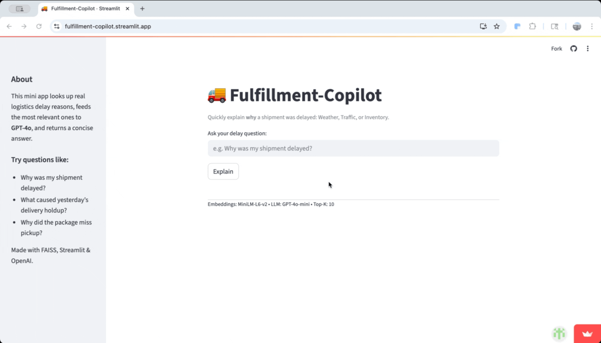

# Fulfillment-Copilot 🚚🤖
RAG-powered seller-support agent • 14-day side project

[](https://fulfillment-copilot.streamlit.app)


<p align="center">
  
</p>


---

## Tech stack & dataset

| Layer      | Choice                                          | Why |
|------------|-------------------------------------------------|-----|
| Data       | **Smart Logistics Supply-Chain Dataset** (Kaggle) | 1 000 real delay reasons |
| Vector DB  | **FAISS**                                       | fast in-process similarity search |
| Embedding  | MiniLM-L6-v2 (sentence-transformers)            | light 384-d vectors |
| LLM        | **GPT-4o-mini**                                 | concise, cheap |
| UI         | **Streamlit**                                   | 1-file web app |
| Cloud      | AWS S3 + Glue/Athena                            | simple, pay-as-you-go |

---

## Architecture

```mermaid
graph TD
  %% AWS ingestion
  subgraph AWS
    S3[(S3 Parquet<br/>shipments.parquet)]
    Glue[Glue Crawler]
    Athena[Athena SQL]
    S3 --> Glue
    Glue --> Athena
  end

  %% RAG pipeline
  E[Embeddings<br/>MiniLM] --> F
  F[FAISS index]

  Q[User query] --> QE[Embed query]
  QE --> F
  F --> K[Top-K passages]
  K --> L[GPT-4o-mini]
  L --> A[Answer<br/>Keyword]

  %% UI joins
  Q --> UI[Streamlit UI]
  A --> UI
  K --> UI


## Evaluation

| Date       | Test set size | Accuracy |
|------------|---------------|----------|
| 2025-07-09 | 15 questions  | **53 %** |

_Current model_: gpt-4o-mini • _Retrieval_: FAISS top-5 • _Prompt_ forces Weather/Traffic/Inventory keyword.

